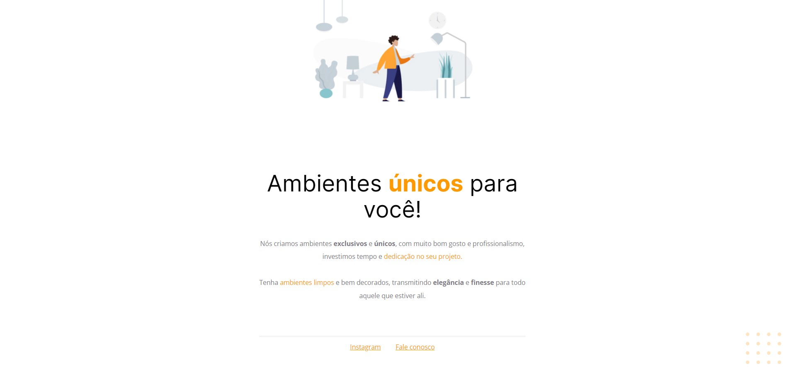

## :bookmark_tabs: Sobre o Projeto

O projeto ***Ambiente DEV*** é uma página estática para treinamento das tecnologias JavaScript, HTML e CSS. Foi desenvolvida no curso EXPLORE da [Rocketseat](https://rocketseat.com.br/).

